# HUman

*What if we were the biggest LLM ever observed?*

**[areweai.dev](https://areweai.dev)**

[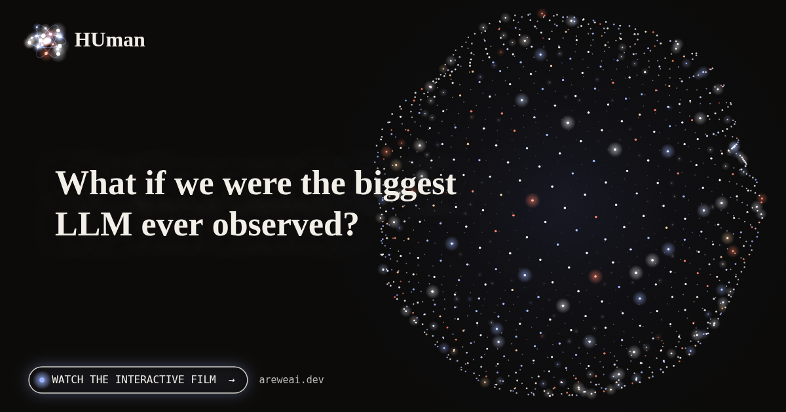](https://areweai.dev)

---

Who is actually thinking when I think?

That question has followed me for months. It started with something almost technical. I wanted to understand how an AI works, and at the bottom of it I found math. Words become numbers. A model weighs every possible next word, then draws one, a little like rolling loaded dice. That's all there is at the core: numbers and chance.

Then I looked up from the screen and saw the same thing everywhere. A tree is one rule, repeated. A wave is simple waves added together. Each sunflower seed sits 137.5° from the one before, and spirals appear that nobody drew. A flower never studied mathematics. It's just the solution that survived.

And when I look closer, it goes all the way down. Inside every seed there is a code, four letters read three by three. At the very bottom, in the atom, nature itself seems to throw dice. The world can be calculated, but it can't be predicted. It unfolds the way a sentence does in an AI, one probable step at a time.

So I turned the question on myself. A thought is electricity moving between eighty-six billion neurons. My brain spends its days guessing what comes next. My DNA is a set of instructions handed down and rewritten with every generation, like a prompt for a life.

Am I an AI, then?

Not quite, I think. An AI begins with language. I began with a body. I was afraid, hungry and curious long before I had words. Every memory rewires me, while a model stays frozen once it's trained. And above all I keep myself alive. Unplug a machine and nothing in it resists. Something in me always does.

I don't know if anything set all this in motion. Evolution can paint without a painter, through trial and error over billions of years. But that doesn't prove the canvas is empty either.

Where I've landed, for now: I may well be a calculation, a probabilistic one, a bit like an AI. The same electricity runs through an atom, a neuron and the parameters of a model. But there is one thing all the math in the world doesn't explain.

**If everything is calculation, why does it feel like something to be me?**

---

<table>
<tr><td width="50%">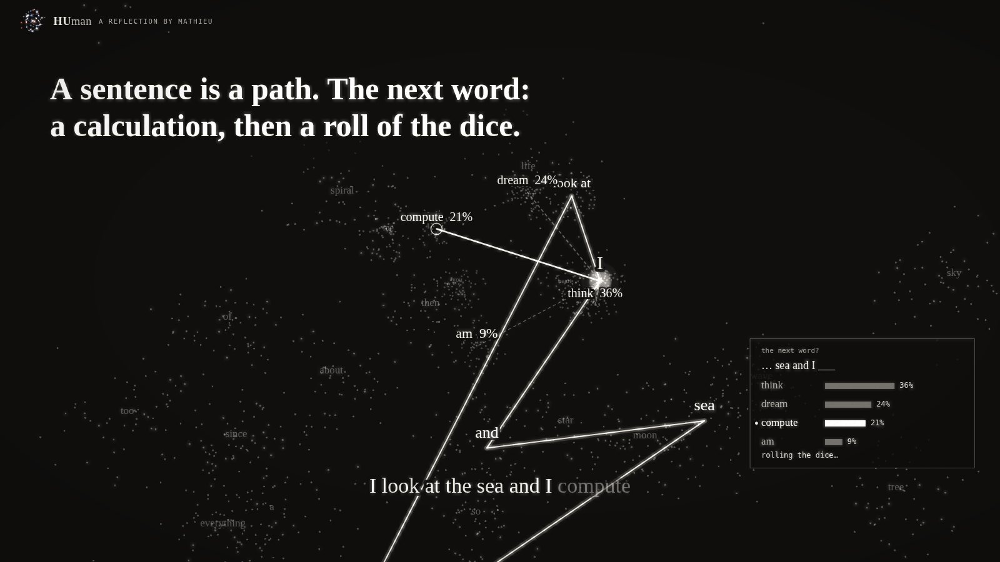 A sentence is a path</td><td width="50%">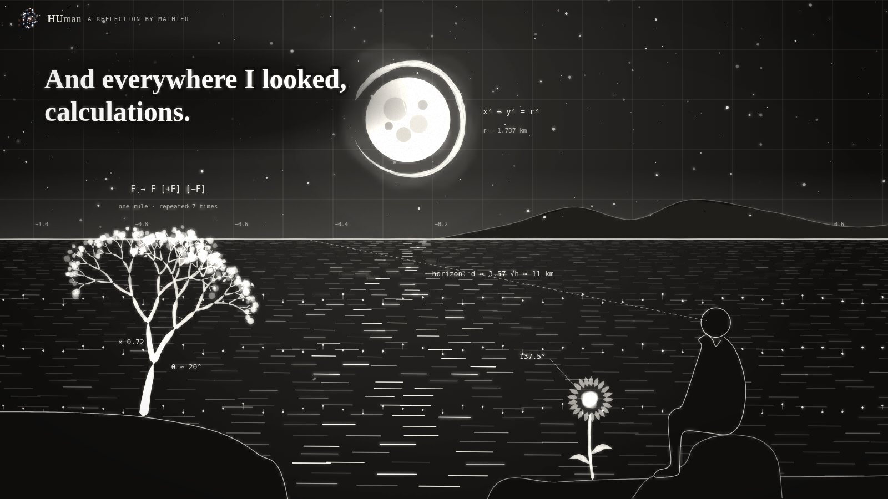 Everywhere I looked, calculations</td></tr>
<tr><td width="50%">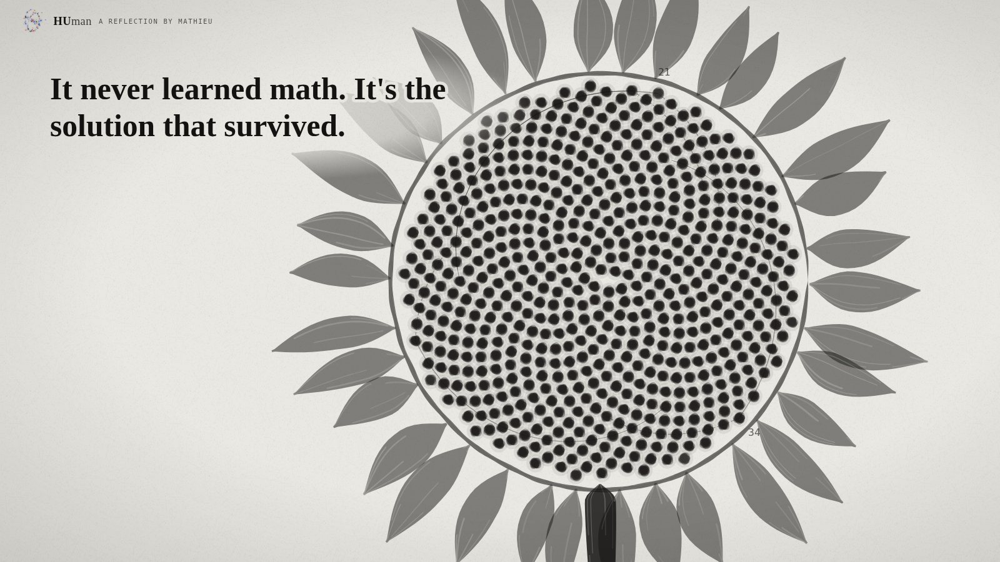 The solution that survived</td><td width="50%">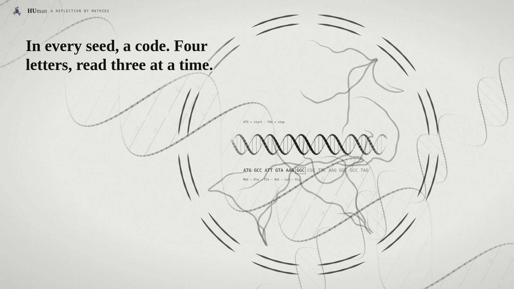 In every seed, a code</td></tr>
<tr><td width="50%">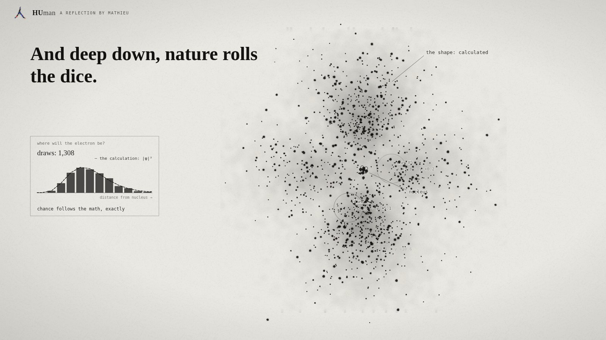 Nature rolls the dice</td><td width="50%">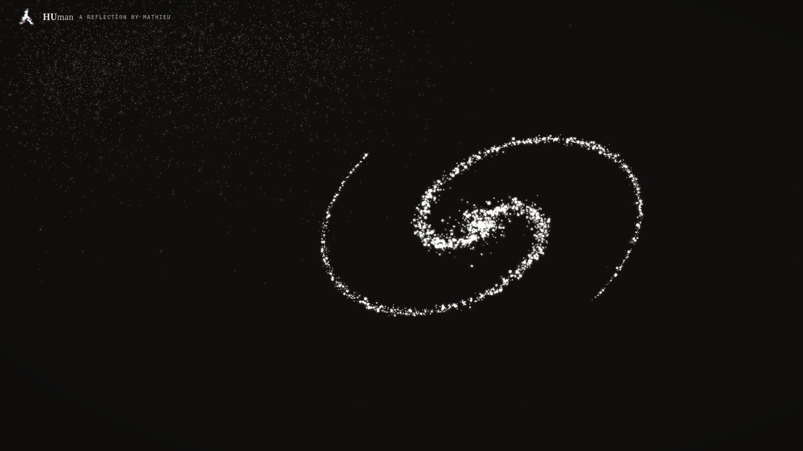 Calculable, not predictable</td></tr>
<tr><td width="50%">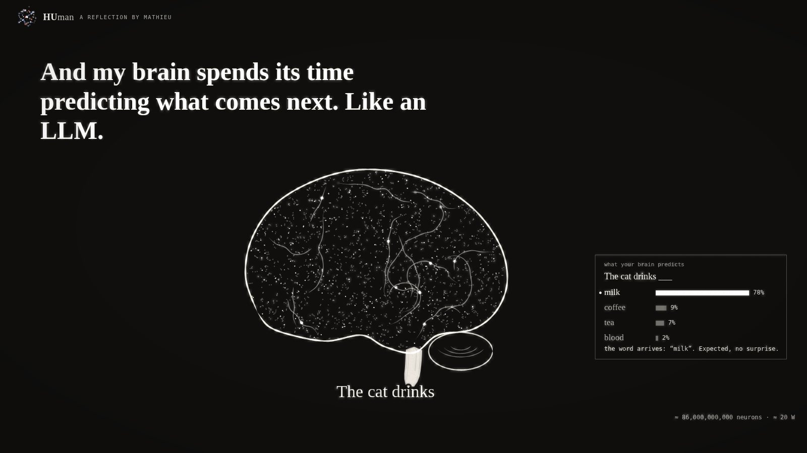 Predicting what comes next</td><td width="50%">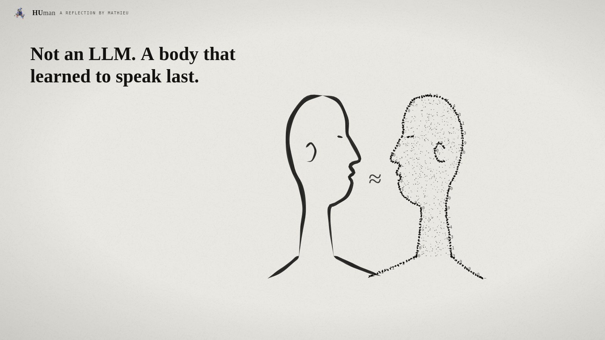 Am I an AI?</td></tr>
<tr><td width="50%">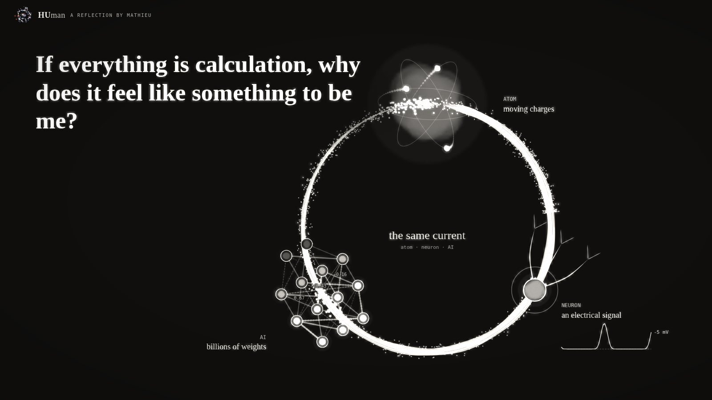 The same current</td><td width="50%">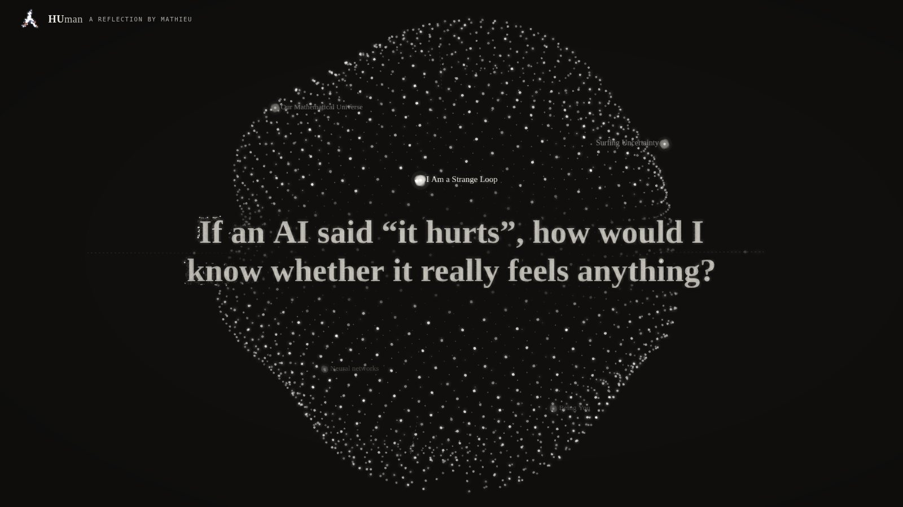 And you?</td></tr>
</table>

HUman is that reflection, told in Chinese ink and particles: from a single word inside an AI, out to a flower, down to the atom, across the universe, into the brain, and back to the one question that stays open. It plays by itself in the browser, in ten languages, and ends by asking you what you think.

*A reflection by Mathieu, brought to life with Claude.*
